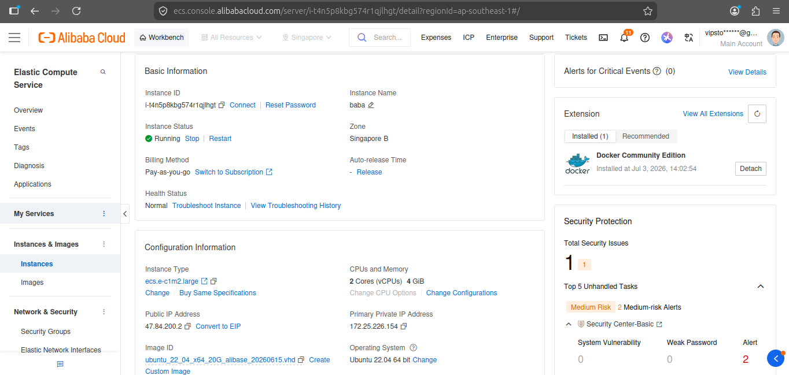
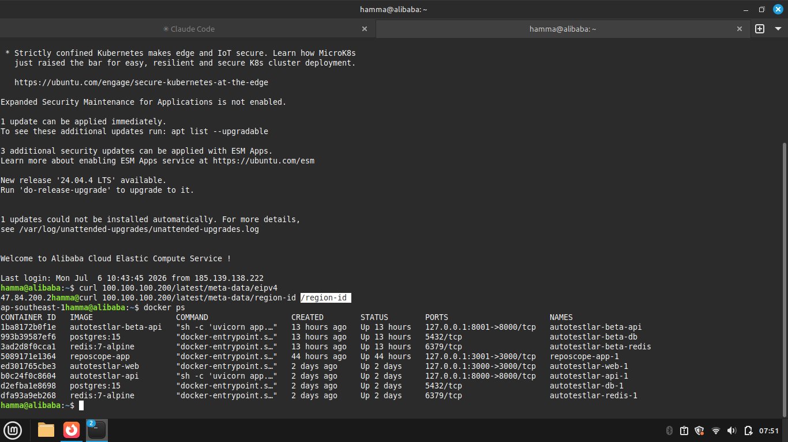
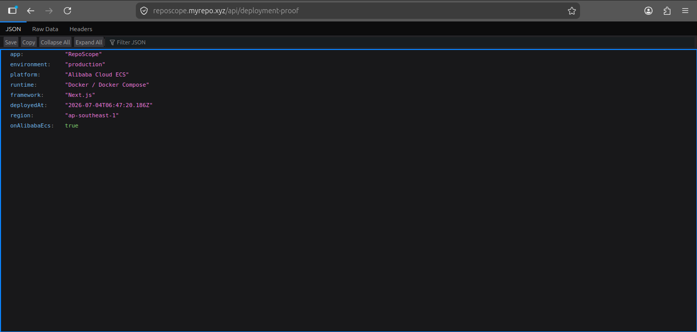
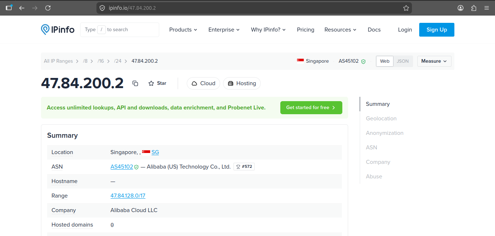

# Alibaba Cloud Deployment Proof — RepoScope

This document is the deployment proof for the **Qwen Cloud / Alibaba Cloud
Global AI Hackathon**. It demonstrates that RepoScope is deployed and running on
an **Alibaba Cloud ECS** instance.

> **Safety note.** Everything in this file is safe to publish. It contains no
> secrets, tokens, credentials, private IPs, or the raw ECS instance-id. Where a
> verification command would print an identifying value (instance-id, private
> IP, serial number), the sample output below is **redacted** with placeholders
> (`i-xxxxxxxxxxxxxxxxxx`, `10.x.x.x`). Run the commands yourself on the server
> to see the real values privately.

---

## Summary

| Field | Value |
| --- | --- |
| **Project name** | RepoScope |
| **Deployment platform** | Alibaba Cloud ECS |
| **ECS region** | `ap-southeast-1` (Singapore) |
| **Runtime** | Docker / Docker Compose |
| **App framework** | Next.js 16 (React 19, standalone output) |
| **Reverse proxy** | Host **Nginx** → `proxy_pass http://127.0.0.1:3001`, TLS via Let's Encrypt (Certbot) |
| **Public demo URL** | https://reposcope.myrepo.xyz |
| **GitHub repository** | https://github.com/xayrullonematov/RepoScope |
| **Deployment proof endpoint** | https://reposcope.myrepo.xyz/api/deployment-proof |

---

## Evidence (screenshots)

> Image files live in [`screenshots/`](screenshots/) — see that folder's README
> for exactly what each shot should contain and what to redact. Until the files
> are added the links below appear as broken images; that is expected.

**1. Alibaba Cloud ECS console — instance running in `ap-southeast-1`, public IP `47.84.200.2`:**



**2. ECS metadata + running container (on the server):**



**3. Public deployment-proof endpoint (browser):**



**4. Independent ASN check — origin IP belongs to Alibaba (AS45102):**



## Architecture

```
Internet
   │  HTTPS (443)
   ▼
Host Nginx  (server_name reposcope.myrepo.xyz, Certbot-managed TLS)
   │  proxy_pass http://127.0.0.1:3001
   ▼
Docker container  reposcope-app-1  (publishes 127.0.0.1:3001 → 3000)
   │
   ▼
Next.js 16 standalone server  (node server.js)  +  SQLite (Docker volume)
```

- The app runs as a Docker container that publishes **only** to `127.0.0.1:3001`
  (never directly to a public port). The host's Nginx terminates TLS and reverse
  proxies to it. This shares the box with other apps cleanly rather than binding
  80/443 from inside Docker.
- The LLM layer talks to **Qwen via the OpenAI-compatible DashScope endpoint**
  (`dashscope-intl.aliyuncs.com`) — consistent with the ECS region above
  (Singapore / International). See `.env.example`.

---

## Deployment commands used

Run from the repository root on the ECS instance:

```bash
# 1. Pull the latest code
git pull

# 2. Build the image and (re)start the container in the background
docker compose up -d --build --remove-orphans

# 3. (Only when prisma/schema.prisma changed) sync the SQLite schema from the
#    HOST — the slim runtime image intentionally omits the full Prisma CLI.
#    The production DB lives in the Docker volume; it must be owned by the
#    container's non-root user (nextjs, uid 1001) afterwards.
sudo env "PATH=$PATH" \
  DATABASE_URL="file:/var/lib/docker/volumes/reposcope_app-data/_data/production.db" \
  npx prisma db push
sudo chown 1001:1001 /var/lib/docker/volumes/reposcope_app-data/_data/production.db
```

`docker-compose.yml` (no secrets — the real values live in the git-ignored
`.env`):

```yaml
services:
  app:
    build: .
    restart: unless-stopped
    ports:
      - "127.0.0.1:3001:3000"   # localhost only; Nginx fronts it
    env_file: .env
    volumes:
      - app-data:/app/data
      - app-exports:/app/.movistan/exports
    environment:
      - DATABASE_URL=file:./data/production.db
      - HOSTNAME=0.0.0.0
```

---

## How to verify the app is deployed

### 1. Containers are running

```bash
docker ps
```

Expected (RepoScope container up, published on localhost `3001`):

```
NAMES            IMAGE          STATUS         PORTS
reposcope-app-1   reposcope-app   Up 4 minutes   127.0.0.1:3001->3000/tcp
```

### 2. Local app health check

The app responds on the loopback port that Nginx proxies to:

```bash
curl -s -o /dev/null -w "HTTP %{http_code}\n" http://127.0.0.1:3001
# → HTTP 200

curl -s http://127.0.0.1:3001/api/config -o /dev/null -w "config API: HTTP %{http_code}\n"
# → config API: HTTP 200
```

### 3. Public deployment-proof endpoint

Safe, non-sensitive deployment metadata (see the route below). The public domain
sits behind Cloudflare's managed bot challenge, so open this URL **in a browser**
(a plain `curl` from a terminal receives the Cloudflare "Just a moment…"
interstitial, not the JSON):

```
https://reposcope.myrepo.xyz/api/deployment-proof
```

To prove the same endpoint from a terminal, hit the app directly on the ECS host
(bypassing Cloudflare/Nginx):

```bash
curl -s http://127.0.0.1:3001/api/deployment-proof
```

Example response:

```json
{
  "app": "RepoScope",
  "environment": "production",
  "platform": "Alibaba Cloud ECS",
  "runtime": "Docker / Docker Compose",
  "framework": "Next.js",
  "deployedAt": "2026-07-04T05:40:00.000Z",
  "region": "ap-southeast-1",
  "onAlibabaEcs": true
}
```

> `onAlibabaEcs: true` means the app successfully queried the Alibaba ECS
> instance metadata service from **inside** the instance. It exposes only the
> region — never the instance-id, IPs, or any secret.

---

## How to verify the server is Alibaba Cloud ECS

Alibaba Cloud ECS exposes an instance metadata service at the link-local address
`100.100.100.200` (the Alibaba equivalent of AWS's `169.254.169.254`). It is
reachable **only from inside the instance**, so answering it is itself proof the
box is an Alibaba Cloud ECS instance.

```bash
# Basename of the host
hostname

# Region — SAFE to share (geography only)
curl -s http://100.100.100.200/latest/meta-data/region-id
# → ap-southeast-1

# List the available metadata keys (proves the Alibaba metadata service exists)
curl -s http://100.100.100.200/latest/meta-data/
# → disks/  dns-conf/  eipv4  hostname  image-id  instance-id  ...  region-id  ...

# Instance identity — DO NOT publish these values (kept private):
#   curl -s http://100.100.100.200/latest/meta-data/instance-id      # → i-xxxxxxxxxxxxxxxxxx
#   curl -s http://100.100.100.200/latest/meta-data/private-ipv4     # → 10.x.x.x
```

A non-Alibaba host cannot answer `100.100.100.200` — the request times out. The
combination of (a) the metadata service responding, (b) `region-id =
ap-southeast-1`, and (c) the Alibaba-specific key set above is sufficient proof.

### Suggested screenshots for the submission

The captured images are embedded in the [Evidence (screenshots)](#evidence-screenshots)
section above and live in [`screenshots/`](screenshots/) with these exact names:

1. `ecs-console-instance.png` — Alibaba Cloud ECS console: instance **Running** in
   `ap-southeast-1`, public IP `47.84.200.2`.
2. `ecs-metadata-region.png` — on the server: `curl http://100.100.100.200/latest/meta-data/region-id`
   → `ap-southeast-1`, plus `docker ps` showing `reposcope-app-1` up.
3. `deployment-proof-endpoint.png` — browser at
   `https://reposcope.myrepo.xyz/api/deployment-proof` showing
   `"platform": "Alibaba Cloud ECS"` and `"onAlibabaEcs": true`.
4. `ipinfo-asn.png` — `ipinfo.io/47.84.200.2` showing **AS45102 Alibaba**, Singapore.

Redact instance-id / private-ipv4 / account login if they appear; the public IP
`47.84.200.2` and region are fine to show.

---

## Independent verification (no trust in this app required)

The `/api/deployment-proof` endpoint is convenient, but its `platform` field is
ultimately a value the app reports about itself. For **third-party, zero-trust**
proof that the origin runs on Alibaba Cloud, check the origin server's public IP
against public internet registries — this relies on neutral sources (IP registry
/ BGP data), not on anything this app says.

**Origin public IP:** `47.84.200.2`

```bash
# Neutral third-party IP intelligence — shows the owning ASN + geo
curl -s https://ipinfo.io/47.84.200.2/json
```

```json
{
  "ip": "47.84.200.2",
  "city": "Singapore",
  "country": "SG",
  "org": "AS45102 Alibaba (US) Technology Co., Ltd.",
  "timezone": "Asia/Singapore"
}
```

Other independent ways to confirm the same fact:

```bash
whois 47.84.200.2 | grep -iE 'netname|org|country'   # → Alibaba, SG
```

- BGP/ASN lookup: <https://bgp.he.net/ip/47.84.200.2> → **AS45102 Alibaba**
- Any "IP → ASN" service will resolve `47.84.200.2` to Alibaba Cloud, Singapore
  (`ap-southeast-1`), matching the `region` reported by the proof endpoint.

### Note on Cloudflare

The public hostname `reposcope.myrepo.xyz` is served **through Cloudflare**, so a
DNS lookup of the *domain* returns Cloudflare addresses, not the origin:

```bash
dig +short reposcope.myrepo.xyz     # → Cloudflare IPs (e.g. 104.21.x / 2606:4700::…)
```

That is expected — Cloudflare fronts the origin for TLS/CDN. The zero-trust proof
above is therefore stated against the **origin IP `47.84.200.2`**, which is the
Alibaba Cloud ECS instance itself. (For the most airtight human proof, pair this
with a screenshot of the Alibaba Cloud ECS console showing the instance in
`ap-southeast-1` with public IP `47.84.200.2`.)

## The deployment-proof route

Source: [`src/app/api/deployment-proof/route.ts`](../src/app/api/deployment-proof/route.ts).

It returns only safe fields (`app`, `environment`, `platform`, `runtime`,
`framework`, `deployedAt`, `region`, `onAlibabaEcs`) and is explicitly designed
**not** to expose API keys, tokens, full environment variables, private IPs, the
ECS instance-id, or the serial number. The `deployedAt` value defaults to the
server start time and can be pinned by a deploy pipeline via the `DEPLOYED_AT`
environment variable.
